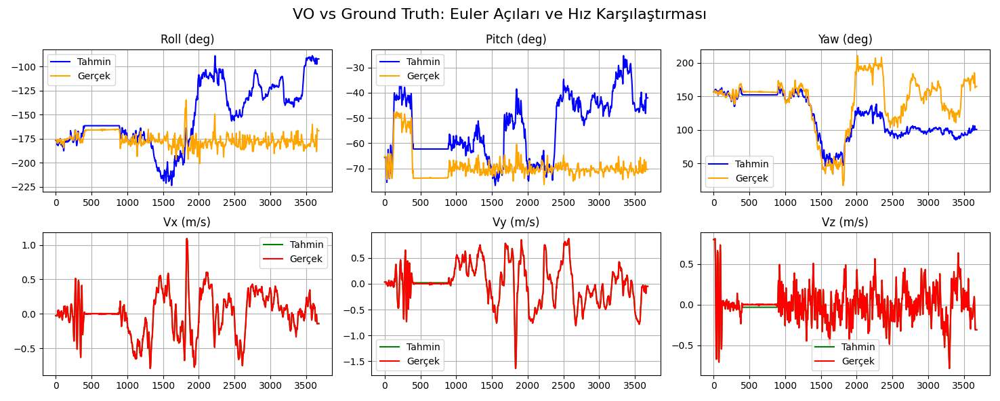
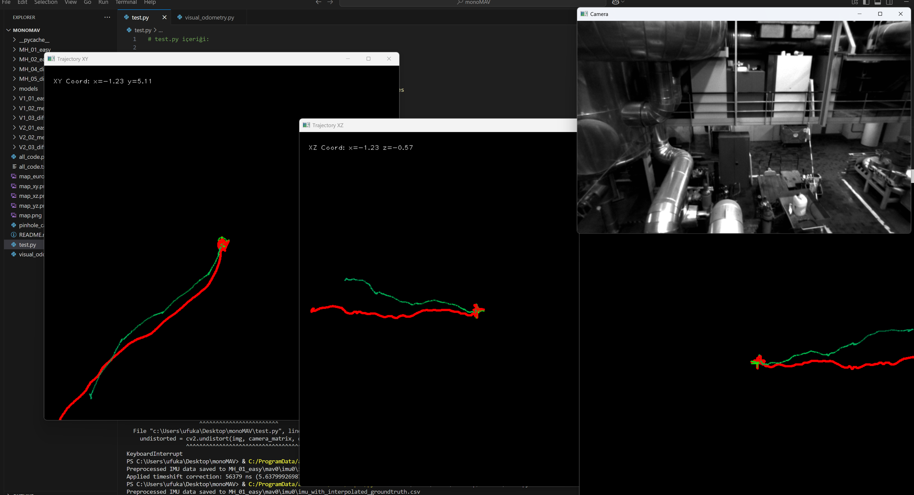

# Visual Odometry (VO) for Euroc MAV Dataset

This project implements a Visual Odometry (VO) application using the Euroc MAV dataset. Stereo camera images synchronized with IMU data are used for feature tracking and pose estimation. Real-time trajectory predictions and comparisons of Euler angles are presented with visual outputs.

## Installation and Usage

### 1. Setting the Dataset Path

You can set the dataset path at the beginning of the `test.py` file:

```python
# test.py
dataset_path = Path("MH_01_easy/mav0/")  # Change this to your own dataset path.
```

### 2. Required Libraries

To install the required libraries, run the following command:

```bash
pip install numpy opencv-python-headless pandas matplotlib
```

### 3. Running the Project

Use the following command to run the project:

```bash
python test.py
```

### 4. Results and Visual Outputs


### Euler Angles and Velocity Comparisons



### Real-Time Trajectory



## Description

### IMU Data Preprocessing

The `preprocess_imu_data()` function synchronizes IMU data with ground truth data. It corrects the time shift between IMU and ground truth timestamps and generates synchronized data through interpolation.

### Visual Odometry (VO)

The `VisualOdometry` class in `visual_odometry.py` performs the following tasks:

1. **Feature Detection:** Detects feature points in the first frame using the FAST detector.
2. **Feature Tracking:** Tracks feature points between consecutive frames using the Lucas-Kanade method.
3. **Pose Estimation:** Estimates pose by computing the essential matrix.
4. **Trajectory Update:** Updates the real-time trajectory with the estimated pose information.

### Trajectory Visualization

In `test.py`, the real-time trajectory is drawn in three different planes:

- **XY Projection**
- **XZ Projection**
- **YZ Projection**

## File Structure

```plaintext
├── test.py                # Main executable file
├── visual_odometry.py     # Visual odometry class and helper functions
├── comp.png               # Euler angles and velocity comparisons
├── traj.png               # Real-time trajectory visualization
└── README.md              # Project documentation
```

## License

This project is licensed under the MIT License.
