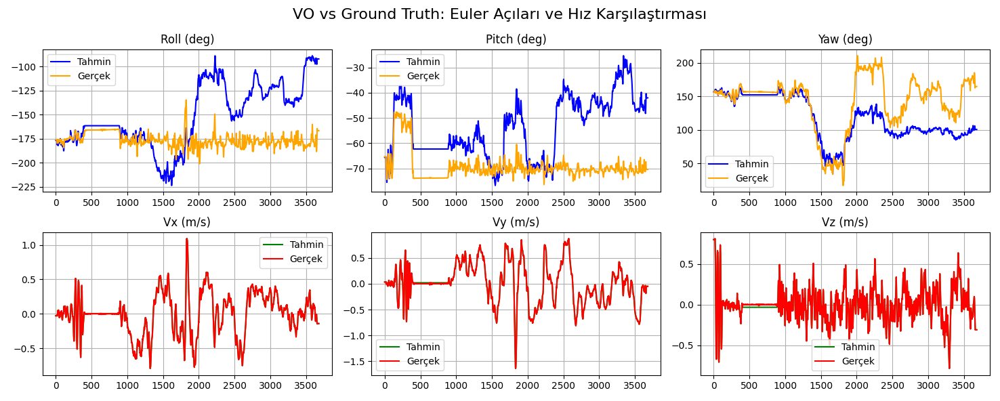
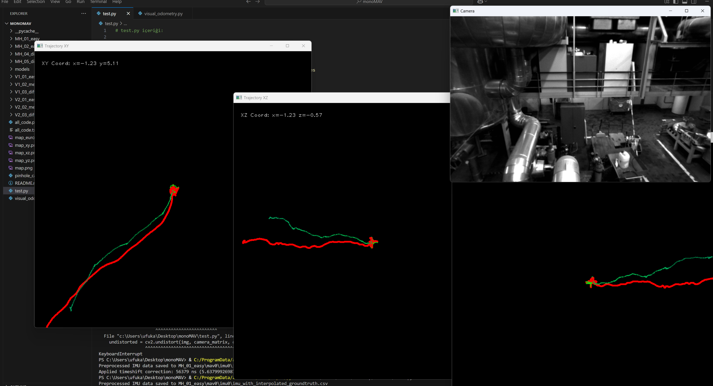

# Monocular Visual Odometry with a KLT Tracker on the EuRoC MAV Dataset

[](LICENSE)

A compact Python implementation of feature-based monocular visual odometry (VO) for the
[EuRoC MAV dataset](https://projects.asl.ethz.ch/datasets/doku.php?id=kmavvisualinertialdatasets).
FAST corners are tracked between consecutive `cam0` frames with the pyramidal Lucas–Kanade (KLT)
optical flow, the relative pose is recovered from the essential matrix, and the camera motion is
mapped into the body (IMU) frame with the EuRoC extrinsic `T_BS`. The estimated trajectory and Euler
angles are compared with the ground truth.

EuRoC is considerably harder for purely visual pipelines than KITTI (aggressive motion, motion blur,
low texture and illumination changes), so reliable inference from vision alone is difficult. The code
is nevertheless useful for understanding the coordinate-frame transformations involved and is intended
as a basis for later sensor-fusion work.

> **Note.** Monocular VO cannot observe metric scale. In this code the per-frame translation scale
> is taken from the ground-truth trajectory, and the initial pose and the velocity series are also
> read from the ground truth. The script is therefore a didactic baseline, not a stand-alone odometry
> system.

## Method overview

The `VisualOdometry` class in `visual_odometry.py` performs the following steps:

1. **Feature detection** – FAST corners (`threshold=25`, non-maximum suppression) in the first frame,
   and re-detection whenever fewer than `kMinNumFeature = 2500` points remain.
2. **Feature tracking** – pyramidal Lucas–Kanade optical flow (`cv2.calcOpticalFlowPyrLK`, 5×5 window).
3. **Pose estimation** – essential matrix with RANSAC (`cv2.findEssentialMat`) followed by
   `cv2.recoverPose`.
4. **Frame transformation** – the camera-frame motion is mapped to the body frame as
   `T_BS · T_cam · T_BS⁻¹`.
5. **Orientation smoothing** – the per-frame change of each Euler angle (roll, pitch, yaw) of the
   estimate is clamped to 5°; the ground truth is never clamped.
6. **Trajectory update** – the translation is scaled with the ground-truth step length and
   accumulated, starting from the first ground-truth pose.

Before the VO loop, `test.py` shifts the ground-truth timestamps by the camera–IMU time offset
(`5.63799926987e-05` s) and linearly interpolates the ground truth onto the IMU timestamps. Images are
undistorted with the EuRoC `cam0` intrinsics and radial–tangential coefficients hard-coded in `test.py`.

## Installation

Python 3 with the following packages:

```bash
pip install numpy opencv-python pandas matplotlib
```

Use `opencv-python` rather than `opencv-python-headless`: the script opens OpenCV windows
(`cv2.imshow`), which the headless build does not support.

## Dataset preparation

Download a EuRoC sequence in ASL format (e.g. `MH_01_easy`) and extract it. The script uses the
following files:

```
MH_01_easy/mav0/
├── cam0/
│   ├── data.csv
│   └── data/<timestamp>.png
├── imu0/data.csv
└── state_groundtruth_estimate0/data.csv
```

The dataset path is set at the top of `test.py` (relative to the working directory):

```python
dataset_path = Path("MH_01_easy/mav0/")  # change this to your own dataset path
```

## Usage

```bash
python test.py
```

## Outputs

- `mav0/imu0/imu_with_interpolated_groundtruth.csv` – ground truth interpolated onto the IMU
  timestamps (written into the dataset directory).
- Live OpenCV windows: the undistorted camera frame and the trajectory in the XY, XZ and YZ planes
  (estimate as a colour gradient, ground truth in red).
- `map_xy.png`, `map_xz.png`, `map_yz.png` – the final trajectory images, saved to the working
  directory.
- A Matplotlib figure comparing roll, pitch and yaw (and the velocity series) with the ground truth;
  it is shown on screen and not saved.

### Euler angles and velocity comparison



*The plot legends are in Turkish (Tahmin = estimate, Gerçek = ground truth).*

### Real-time trajectory



*Screenshot of a run: the trajectory windows (estimate in green, ground truth in red) and the camera view.*

## Repository layout

```
├── test.py              # main script: preprocessing, VO loop, visualisation
├── visual_odometry.py   # VisualOdometry class and rotation helpers
├── comp.png             # example Euler-angle / velocity comparison
└── traj.png             # example trajectory visualisation
```

## Acknowledgements

- The frame-to-frame VO structure follows [uoip/monoVO-python](https://github.com/uoip/monoVO-python).
- EuRoC MAV dataset: M. Burri et al., "The EuRoC micro aerial vehicle datasets," *The International
  Journal of Robotics Research*, 2016.

## License

This project is licensed under the MIT License; see [LICENSE](LICENSE).

## Contact

Dr. Ufuk Asil – OSTİM Technical University, Ankara, Türkiye – GitHub: [@ufukasia](https://github.com/ufukasia)
